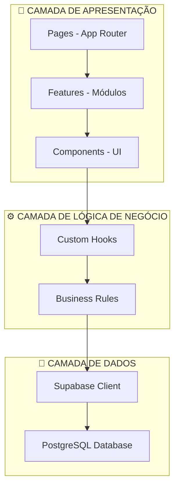
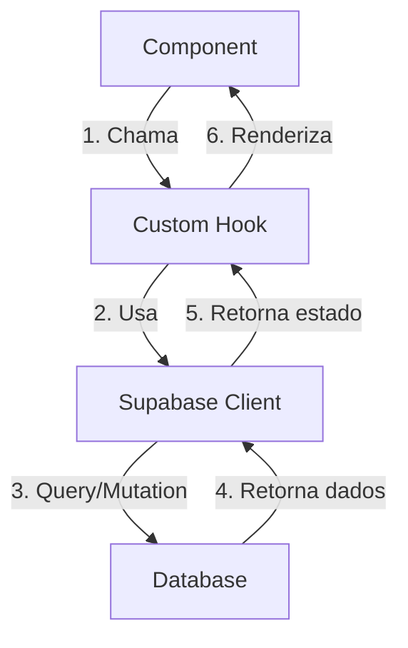
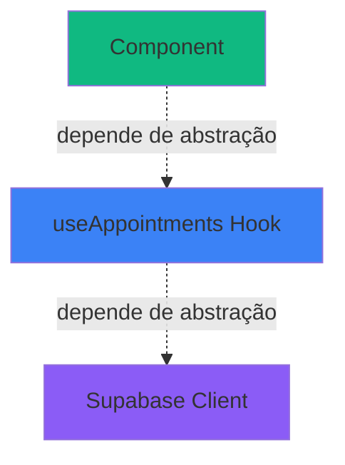
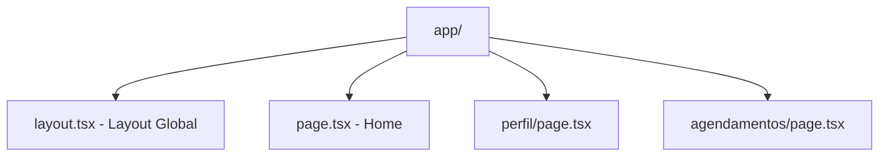
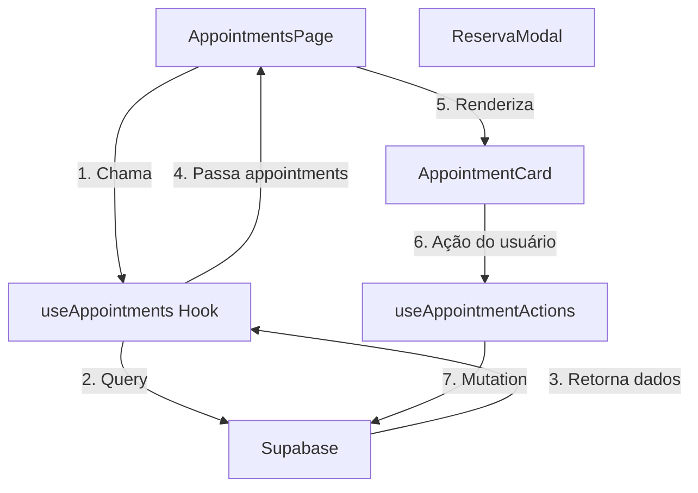
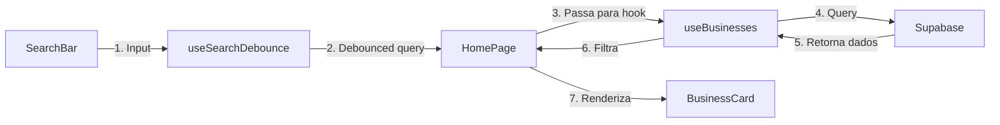
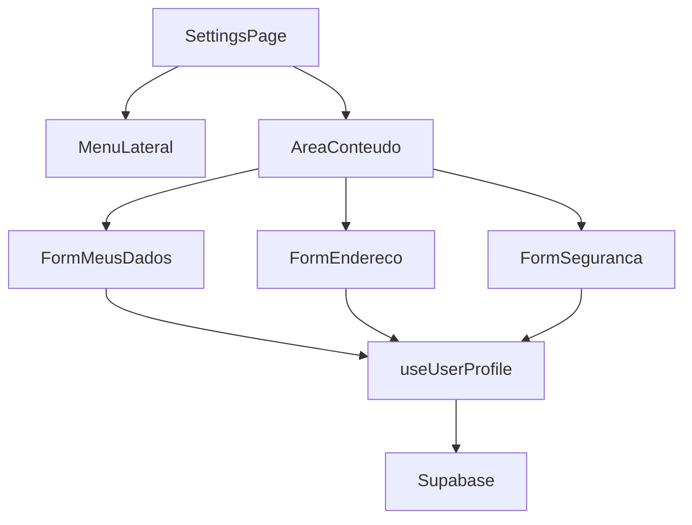
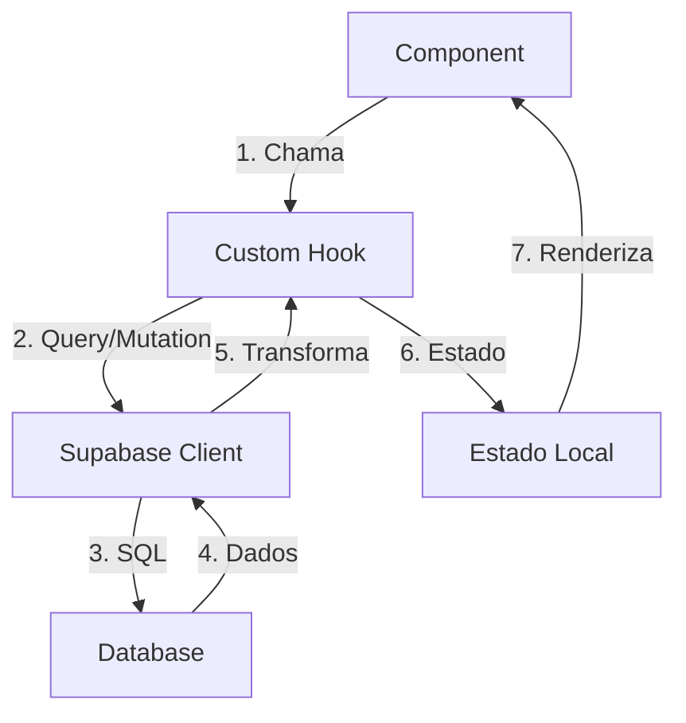
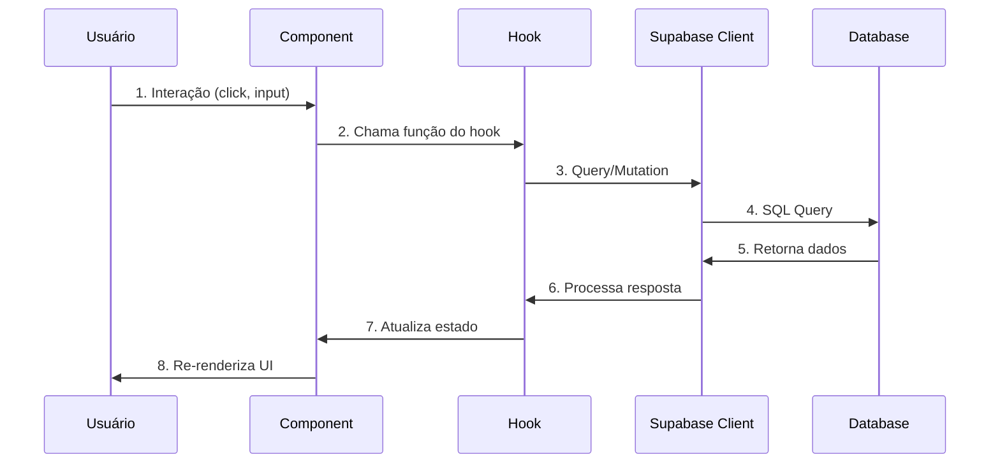
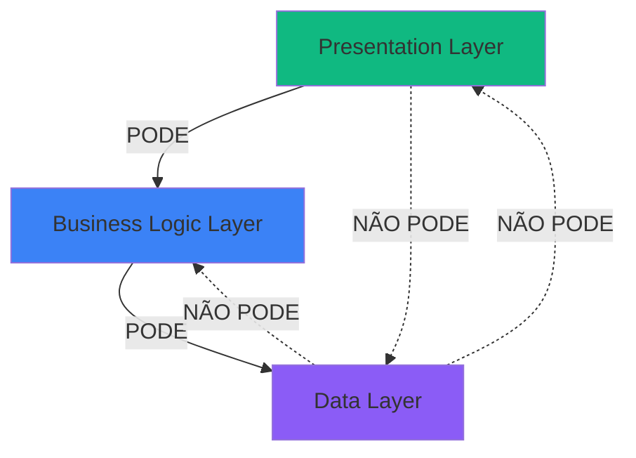

# 🏗️ Arquitetura do Projeto - Hora Certa

> Documentação técnica da arquitetura, estrutura de pastas e princípios de design aplicados

## 📋 Índice

- [Visão Geral da Arquitetura](#-visão-geral-da-arquitetura)
- [Clean Architecture](#-clean-architecture)
- [Princípios SOLID](#-princípios-solid)
- [Estrutura de Pastas](#-estrutura-de-pastas)
- [Fluxo de Dados](#-fluxo-de-dados)
- [Comunicação entre Camadas](#-comunicação-entre-camadas)

---

## 🏛️ Visão Geral da Arquitetura

Este projeto segue os princípios de **Clean Architecture** e **SOLID**, organizando o código em **3 camadas bem definidas**:



### 📐 Separação de Responsabilidades

| Camada | Responsabilidade | Exemplos |
|--------|------------------|----------|
| **Presentation** | Interface do usuário, interação, rotas | `HomePage`, `BarbeariaModal`, `Header` |
| **Business Logic** | Regras de negócio, validações, transformações | `useAuth`, `useAppointments`, `useBusinesses` |
| **Data** | Acesso a dados, queries, mutations | `supabase.from('appointments')` |

---

## 🧩 Clean Architecture

### Fluxo Unidirecional de Dependências



**Regra de Dependência**: Camadas externas dependem de camadas internas, **nunca o inverso**.

### Benefícios

✅ **Testabilidade**: Cada camada pode ser testada isoladamente  
✅ **Manutenibilidade**: Mudanças em uma camada não afetam outras  
✅ **Escalabilidade**: Fácil adicionar novas features sem quebrar existentes  
✅ **Reutilização**: Hooks e componentes podem ser reutilizados  

---

## 🎯 Princípios SOLID

### **S** - Single Responsibility Principle

> Cada módulo deve ter apenas uma razão para mudar

**Aplicação no projeto:**

```typescript
// ✅ BOM - Componente com responsabilidade única
export function AppointmentCard({ appointment }: Props) {
  return <div>{/* Apenas renderiza o card */}</div>
}

// ✅ BOM - Hook com responsabilidade única
export function useAppointments() {
  // Apenas gerencia lógica de agendamentos
  return { appointments, loading, error };
}

// ❌ RUIM - Componente fazendo lógica de negócio
export function AppointmentCard({ appointment }: Props) {
  const data = supabase.from('appointments').select(); // ❌ Não!
  return <div>{data}</div>
}
```

**Exemplo real:**
- `Header.tsx` → Apenas renderiza o cabeçalho
- `useAuth.ts` → Apenas gerencia autenticação
- `SupabaseClient.ts` → Apenas configura o cliente

---

### **O** - Open/Closed Principle

> Aberto para extensão, fechado para modificação

**Aplicação no projeto:**

```typescript
// ✅ Extensível via props
interface BarbeariaModalProps {
  business: Business;
  onClose?: () => void;
  initialTab?: 'servicos' | 'profissionais' | 'detalhes'; // Extensível
}

export function BarbeariaModal(props: BarbeariaModalProps) {
  // Comportamento customizável sem modificar código interno
}

// Uso 1: Modal padrão
<BarbeariaModal business={barbearia} />

// Uso 2: Modal com tab inicial customizada (extensão)
<BarbeariaModal business={barbearia} initialTab="profissionais" />
```

**Exemplo real:**
- Componentes recebem callbacks via props (`onSuccess`, `onClose`)
- Hooks aceitam configurações opcionais
- Formulários validam via schemas extensíveis

---

### **L** - Liskov Substitution Principle

> Subtipos devem ser substituíveis por seus tipos base

**Aplicação no projeto:**

```typescript
// Interface base para modais
interface BaseModalProps {
  isOpen: boolean;
  onClose: () => void;
}

// Todos os modais seguem o mesmo contrato
export function LoginModal({ isOpen, onClose }: BaseModalProps & { ... }) {}
export function ReservaModal({ isOpen, onClose }: BaseModalProps & { ... }) {}
export function CancelModal({ isOpen, onClose }: BaseModalProps & { ... }) {}

// ✅ Podem ser usados intercambiavelmente
const Modal = userType === 'guest' ? LoginModal : ReservaModal;
<Modal isOpen={isOpen} onClose={handleClose} />
```

**Exemplo real:**
- Todos os formulários em `/settings/components/forms/` seguem a mesma interface
- Todos os hooks retornam padrão `{ data, loading, error }`

---

### **I** - Interface Segregation Principle

> Clientes não devem depender de interfaces que não usam

**Aplicação no projeto:**

```typescript
// ❌ RUIM - Interface gigante
interface UserHook {
  login: () => void;
  logout: () => void;
  updateProfile: () => void;
  getAppointments: () => void;
  getFavorites: () => void;
  // ... 20 métodos
}

// ✅ BOM - Hooks específicos e segregados
useAuth()          // { login, logout, signUp }
useUserProfile()   // { profile, updateProfile }
useAppointments()  // { appointments, createAppointment }
useFavorites()     // { favorites, addFavorite }
```

**Exemplo real:**
- `useAuth` → Apenas autenticação
- `useAppointments` → Apenas agendamentos
- `useFavorites` → Apenas favoritos
- `useGeolocation` → Apenas localização

Cada hook tem **interface mínima** e **foco único**.

---

### **D** - Dependency Inversion Principle

> Dependa de abstrações, não de implementações concretas

**Aplicação no projeto:**



```typescript
// ✅ Componente depende de abstração (hook)
export function AppointmentsPage() {
  const { appointments } = useAppointments(); // Abstração
  // Não sabe de onde vem os dados (Supabase? API? Mock?)
}

// ✅ Hook encapsula implementação
export function useAppointments() {
  // Implementação pode mudar (Supabase → REST API → GraphQL)
  const { data } = supabase.from('appointments').select();
  return { appointments: data };
}

// ✅ Fácil de mockar para testes
export function useAppointments() {
  if (process.env.NODE_ENV === 'test') {
    return { appointments: mockData };
  }
  // ...
}
```

**Benefício**: Trocar de Supabase para outra solução exige mudar **apenas os hooks**, componentes permanecem iguais.

---

## 📁 Estrutura de Pastas

### 🌳 Organização por Camadas

```
agendai-clientes-next/
│
├── app/                              # 🎨 CAMADA DE APRESENTAÇÃO - Rotas
│   ├── layout.tsx                    # Layout raiz com providers
│   ├── page.tsx                      # Rota / → HomePage
│   ├── perfil/page.tsx               # Rota /perfil → SettingsPage
│   └── agendamentos/page.tsx         # Rota /agendamentos → AppointmentsPage
│
├── src/
│   ├── features/                     # 🎯 FEATURES - Módulos autocontidos
│   │   ├── home/
│   │   │   ├── HomePage.tsx          # Página principal da feature
│   │   │   ├── components/           # Componentes específicos
│   │   │   └── hooks/                # Hooks específicos da feature
│   │   │
│   │   ├── appointments/
│   │   │   ├── AppointmentsPage.tsx
│   │   │   ├── components/
│   │   │   │   ├── AppointmentCard.tsx
│   │   │   │   ├── ReservaModal.tsx
│   │   │   │   └── NextAppointments.tsx
│   │   │   └── hooks/
│   │   │       └── useAppointmentActions.ts
│   │   │
│   │   ├── business/
│   │   │   └── components/
│   │   │       ├── BarbeariaModal.tsx
│   │   │       └── ProfessionalsTab.tsx
│   │   │
│   │   ├── auth/
│   │   │   └── components/
│   │   │       └── LoginModal.tsx
│   │   │
│   │   └── settings/
│   │       ├── SettingsPage.tsx
│   │       └── components/
│   │           ├── MenuLateral.tsx
│   │           └── forms/
│   │               ├── FormMeusDados.tsx
│   │               ├── FormEndereco.tsx
│   │               └── FormSeguranca.tsx
│   │
│   ├── components/                   # 🧩 COMPONENTES COMPARTILHADOS
│   │   ├── layout/                   # Layout global
│   │   │   ├── Header.tsx
│   │   │   └── Navigation.tsx
│   │   └── shared/                   # Reutilizáveis entre features
│   │       ├── ProtectedRoute.tsx
│   │       └── LocationModal.tsx
│   │
│   ├── hooks/                        # ⚙️ CAMADA DE LÓGICA DE NEGÓCIO
│   │   ├── useAuth.ts
│   │   ├── useAppointments.ts
│   │   ├── useBusinesses.ts
│   │   ├── useFavorites.ts
│   │   └── useGeolocation.ts
│   │
│   ├── lib/                          # 💾 CAMADA DE DADOS
│   │   └── SupabaseClient.ts
│   │
│   └── types/                        # 📦 TIPOS GLOBAIS
│       └── types.ts
```

---

## 📂 Detalhamento por Camada

### 📱 `/app` - Camada de Rotas

**Responsabilidade**: Define as rotas da aplicação usando o App Router do Next.js.



| Arquivo | Renderiza | Tipo |
|---------|-----------|------|
| `layout.tsx` | Header + Navigation + {children} | Server Component |
| `page.tsx` | `<HomePage />` | Server Component |
| `perfil/page.tsx` | `<SettingsPage />` | Server Component |
| `agendamentos/page.tsx` | `<AppointmentsPage />` | Server Component |

**Padrão**: Páginas são **Server Components** por padrão, delegam lógica para features.

### 🧩 `/src/components` - Componentes Compartilhados

**Responsabilidade**: Componentes usados por **múltiplas features**.

#### 📁 `/components/layout` - Layout Global

```typescript
// Header.tsx
export function Header() {
  const { user } = useAuth();           // Hook de autenticação
  const { profile } = useUserProfile(); // Hook de perfil
  
  return (
    <header>
      {user ? <UserMenu /> : <LoginButton />}
    </header>
  );
}

// Navigation.tsx
export function Navigation() {
  const pathname = usePathname(); // Hook do Next.js
  
  return (
    <nav>
      <Link href="/" className={pathname === '/' ? 'active' : ''}>
        Home
      </Link>
      {/* ... */}
    </nav>
  );
}
```

**Princípio SOLID aplicado**:
- ✅ **Single Responsibility**: Header cuida apenas do cabeçalho
- ✅ **Dependency Inversion**: Usa hooks (abstrações), não Supabase direto

---

#### 📁 `/components/shared` - Reutilizáveis

```typescript
// ProtectedRoute.tsx - HOC para proteção de rotas
export function ProtectedRoute({ children }: Props) {
  const { user, loading } = useAuth(); // Abstração
  
  if (loading) return <Loading />;
  if (!user) return <LoginModal />;
  
  return <>{children}</>;
}

// LocationModal.tsx
export function LocationModal({ isOpen, onClose }: Props) {
  const { requestLocation } = useGeolocation(); // Abstração
  
  const handleGrant = async () => {
    await requestLocation();
    onClose();
  };
  
  return <Modal>{/* ... */}</Modal>;
}
```

**Princípio SOLID aplicado**:
- ✅ **Open/Closed**: Extensível via props, fechado para modificação
- ✅ **Interface Segregation**: Cada componente tem interface mínima

### 🎯 `/src/features` - Módulos de Funcionalidade

**Responsabilidade**: Cada feature é **autocontida** e **independente**.

#### Padrão de Organização

```
feature/
├── FeaturePage.tsx          # Orquestra a feature
├── components/              # Componentes específicos
└── hooks/                   # Lógica específica (opcional)
```

---

#### 📅 Feature: `appointments`

**Fluxo de Comunicação**:



**Código**:

```typescript
// AppointmentsPage.tsx
export function AppointmentsPage() {
  const { appointments, loading } = useAppointments(); // Hook global
  const [selectedId, setSelectedId] = useState(null);
  
  return (
    <>
      {appointments.map(apt => (
        <AppointmentCard 
          appointment={apt}
          onClick={() => setSelectedId(apt.id)}
        />
      ))}
      
      <ReservaModal 
        isOpen={!!selectedId}
        onClose={() => setSelectedId(null)}
      />
    </>
  );
}

// components/AppointmentCard.tsx
export function AppointmentCard({ appointment, onClick }: Props) {
  const { formatDate } = useDateFormatter(); // Hook local da feature
  
  return (
    <div onClick={onClick}>
      <h3>{appointment.service_name}</h3>
      <p>{formatDate(appointment.date)}</p>
    </div>
  );
}
```

**Princípios SOLID aplicados**:
- ✅ **Single Responsibility**: Cada componente uma responsabilidade
- ✅ **Dependency Inversion**: Depende de hooks, não de Supabase direto
- ✅ **Open/Closed**: Extensível via props (`onClick`, `onSuccess`)

---

#### 🏠 Feature: `home`

**Fluxo de Busca e Filtragem**:



**Código**:

```typescript
// HomePage.tsx
export function HomePage() {
  const [searchTerm, setSearchTerm] = useState('');
  const debouncedSearch = useSearchDebounce(searchTerm, 500);
  const { businesses, loading } = useBusinesses();
  
  const filtered = businesses.filter(b => 
    b.name.toLowerCase().includes(debouncedSearch.toLowerCase())
  );
  
  return (
    <>
      <SearchBar value={searchTerm} onChange={setSearchTerm} />
      {filtered.map(business => (
        <BusinessCard key={business.id} business={business} />
      ))}
    </>
  );
}

// components/SearchBar.tsx
export function SearchBar({ value, onChange }: Props) {
  return (
    <input 
      value={value}
      onChange={(e) => onChange(e.target.value)}
      placeholder="Buscar estabelecimentos..."
    />
  );
}
```

**Princípios aplicados**:
- ✅ **Interface Segregation**: SearchBar só recebe o necessário
- ✅ **Single Responsibility**: HomePage orquestra, SearchBar apenas renderiza

---

#### ⚙️ Feature: `settings`

**Arquitetura de Formulários**:



**Código**:

```typescript
// SettingsPage.tsx
export function SettingsPage() {
  const [activeTab, setActiveTab] = useState('dados');
  
  return (
    <div className="flex">
      <MenuLateral activeTab={activeTab} onChange={setActiveTab} />
      
      <AreaConteudo>
        {activeTab === 'dados' && <FormMeusDados />}
        {activeTab === 'endereco' && <FormEndereco />}
        {activeTab === 'seguranca' && <FormSeguranca />}
      </AreaConteudo>
    </div>
  );
}

// components/forms/FormMeusDados.tsx
export function FormMeusDados() {
  const { profile, updateProfile } = useUserProfile(); // Hook global
  const [formData, setFormData] = useState(profile);
  
  const handleSubmit = async () => {
    await updateProfile(formData);
  };
  
  return <form onSubmit={handleSubmit}>{/* ... */}</form>;
}
```

**Princípios aplicados**:
- ✅ **Liskov Substitution**: Todos os formulários são intercambiáveis
- ✅ **Open/Closed**: Adicionar novo formulário não requer modificar existentes

### ⚙️ `/src/hooks` - Camada de Lógica de Negócio

**Responsabilidade**: Encapsular **toda lógica de negócio** e acesso a dados.

#### Arquitetura de Hooks



---

#### Padrão de Hook

Todos os hooks seguem o mesmo padrão de retorno:

```typescript
// Padrão: { data, loading, error, actions }
interface HookReturn<T> {
  data: T | null;
  loading: boolean;
  error: Error | null;
  // + ações específicas (create, update, delete)
}
```

---

#### `useAuth` - Autenticação

```typescript
// hooks/useAuth.ts
export function useAuth() {
  const [user, setUser] = useState<User | null>(null);
  const [loading, setLoading] = useState(true);
  
  // Observa mudanças de sessão
  useEffect(() => {
    const { data } = supabase.auth.onAuthStateChange((event, session) => {
      setUser(session?.user ?? null);
    });
    return () => data.subscription.unsubscribe();
  }, []);
  
  const signIn = async (email: string, password: string) => {
    const { error } = await supabase.auth.signInWithPassword({ 
      email, 
      password 
    });
    if (error) throw error;
  };
  
  const signOut = async () => {
    await supabase.auth.signOut();
  };
  
  return { user, loading, signIn, signOut };
}

// Uso no componente
export function Header() {
  const { user, signOut } = useAuth(); // Abstração limpa
  
  return user ? (
    <button onClick={signOut}>Sair</button>
  ) : (
    <LoginButton />
  );
}
```

**Princípios SOLID**:
- ✅ **Single Responsibility**: Apenas autenticação
- ✅ **Dependency Inversion**: Componentes dependem do hook, não do Supabase

---

#### `useAppointments` - Agendamentos

```typescript
// hooks/useAppointments.ts
export function useAppointments(userId?: string) {
  const [appointments, setAppointments] = useState<Appointment[]>([]);
  const [loading, setLoading] = useState(true);
  
  useEffect(() => {
    if (!userId) return;
    
    const fetchAppointments = async () => {
      const { data, error } = await supabase
        .from('appointments')
        .select(`
          *,
          businesses(name, address),
          services(name, price, duration)
        `)
        .eq('user_id', userId)
        .order('date', { ascending: true });
      
      if (!error) setAppointments(data);
      setLoading(false);
    };
    
    fetchAppointments();
  }, [userId]);
  
  const createAppointment = async (data: CreateAppointmentDTO) => {
    const { error } = await supabase
      .from('appointments')
      .insert(data);
    
    if (error) throw error;
    // Recarrega lista após criar
    fetchAppointments();
  };
  
  return { appointments, loading, createAppointment };
}

// Uso no componente
export function AppointmentsPage() {
  const { user } = useAuth();
  const { appointments, loading, createAppointment } = useAppointments(user?.id);
  
  if (loading) return <Loading />;
  
  return (
    <>
      {appointments.map(apt => (
        <AppointmentCard key={apt.id} appointment={apt} />
      ))}
      
      <ReservaModal onSubmit={createAppointment} />
    </>
  );
}
```

**Benefícios**:
- ✅ Componentes **não sabem** que usam Supabase
- ✅ Fácil **trocar** backend (Supabase → REST API → GraphQL)
- ✅ Fácil **mockar** para testes

---

#### `useBusinesses` - Estabelecimentos

```typescript
// hooks/useBusinesses.ts
export function useBusinesses(filters?: { city?: string; category?: string }) {
  const [businesses, setBusinesses] = useState<Business[]>([]);
  const [loading, setLoading] = useState(true);
  
  useEffect(() => {
    const fetchBusinesses = async () => {
      let query = supabase
        .from('businesses')
        .select(`
          *,
          addresses(city, state, street)
        `);
      
      if (filters?.city) {
        query = query.eq('addresses.city', filters.city);
      }
      
      const { data } = await query;
      setBusinesses(data || []);
      setLoading(false);
    };
    
    fetchBusinesses();
  }, [filters]);
  
  return { businesses, loading };
}

// Uso com filtros
export function HomePage() {
  const { latitude, longitude } = useGeolocation();
  const { businesses } = useBusinesses({ 
    city: 'São Paulo' // Poderia ser baseado em geolocalização
  });
  
  return (
    <>
      {businesses.map(business => (
        <BusinessCard key={business.id} business={business} />
      ))}
    </>
  );
}
```

---

#### `useFavorites` - Favoritos

```typescript
// hooks/useFavorites.ts
export function useFavorites(userId?: string) {
  const [favorites, setFavorites] = useState<string[]>([]);
  
  useEffect(() => {
    if (!userId) return;
    
    const fetchFavorites = async () => {
      const { data } = await supabase
        .from('favorites')
        .select('business_id')
        .eq('user_id', userId);
      
      setFavorites(data?.map(f => f.business_id) || []);
    };
    
    fetchFavorites();
  }, [userId]);
  
  const addFavorite = async (businessId: string) => {
    await supabase.from('favorites').insert({ 
      user_id: userId, 
      business_id: businessId 
    });
    
    setFavorites(prev => [...prev, businessId]);
  };
  
  const removeFavorite = async (businessId: string) => {
    await supabase.from('favorites').delete()
      .eq('user_id', userId)
      .eq('business_id', businessId);
    
    setFavorites(prev => prev.filter(id => id !== businessId));
  };
  
  const isFavorite = (businessId: string) => favorites.includes(businessId);
  
  return { favorites, addFavorite, removeFavorite, isFavorite };
}

// Uso no componente
export function BusinessCard({ business }: Props) {
  const { user } = useAuth();
  const { isFavorite, addFavorite, removeFavorite } = useFavorites(user?.id);
  
  const handleToggleFavorite = () => {
    if (isFavorite(business.id)) {
      removeFavorite(business.id);
    } else {
      addFavorite(business.id);
    }
  };
  
  return (
    <div>
      <h3>{business.name}</h3>
      <button onClick={handleToggleFavorite}>
        {isFavorite(business.id) ? '❤️' : '🤍'}
      </button>
    </div>
  );
}
```

---

#### Resumo dos Hooks

| Hook | Responsabilidade | Retorno Principal |
|------|------------------|-------------------|
| `useAuth` | Autenticação | `{ user, signIn, signOut }` |
| `useUserProfile` | Perfil do usuário | `{ profile, updateProfile }` |
| `useAppointments` | CRUD de agendamentos | `{ appointments, createAppointment }` |
| `useBusinesses` | Listagem de estabelecimentos | `{ businesses, loading }` |
| `useFavorites` | Gerenciar favoritos | `{ favorites, addFavorite, removeFavorite }` |
| `useGeolocation` | Obter localização | `{ latitude, longitude, requestLocation }` |
| `useProfessionals` | Listar profissionais | `{ professionals, loading }` |
| `useServices` | Listar serviços | `{ services, loading }` |

**Princípio aplicado**: Todos os hooks seguem **Interface Segregation** - cada um tem responsabilidade única e interface mínima.

### 💾 `/src/lib` - Camada de Dados

**Responsabilidade**: Configurar e exportar clientes de serviços externos.

```typescript
// lib/SupabaseClient.ts
import { createClient } from '@supabase/supabase-js';
import type { Database } from '../types/database.types';

// Singleton: uma única instância do cliente
export const supabase = createClient<Database>(
  process.env.NEXT_PUBLIC_SUPABASE_URL!,
  process.env.NEXT_PUBLIC_SUPABASE_ANON_KEY!,
  {
    auth: {
      persistSession: true,
      autoRefreshToken: true,
    },
  }
);
```

**Princípio aplicado**:
- ✅ **Dependency Inversion**: Hooks dependem desta abstração
- ✅ **Single Responsibility**: Apenas configuração do cliente

**Benefício**: Para migrar de Supabase para outro backend, basta mudar este arquivo e os hooks.

---

### 📦 `/src/types` - Definições de Tipos

**Responsabilidade**: Centralizar todas as interfaces TypeScript.

```typescript
// types/types.ts

// Entidades do banco de dados
export interface User {
  id: string;
  email: string;
  name: string;
  phone?: string;
  created_at: string;
}

export interface Business {
  id: string;
  name: string;
  description?: string;
  phone: string;
  email?: string;
  created_at: string;
}

export interface Appointment {
  id: string;
  user_id: string;
  business_id: string;
  service_id: string;
  professional_id: string;
  date: string;
  time: string;
  status: 'scheduled' | 'completed' | 'cancelled';
  created_at: string;
}

export interface Service {
  id: string;
  business_id: string;
  name: string;
  description?: string;
  price: number;
  duration: number; // em minutos
}

// DTOs (Data Transfer Objects)
export interface CreateAppointmentDTO {
  business_id: string;
  service_id: string;
  professional_id: string;
  date: string;
  time: string;
}

export interface UpdateUserProfileDTO {
  name?: string;
  phone?: string;
  avatar_url?: string;
}

// View Models (dados transformados para UI)
export interface AppointmentWithDetails extends Appointment {
  business_name: string;
  service_name: string;
  professional_name: string;
  formatted_date: string;
}
```

**Princípio aplicado**:
- ✅ **Single Responsibility**: Apenas definições de tipos
- ✅ **Open/Closed**: Fácil adicionar novos tipos sem modificar existentes

**Benefício**: Type safety em todo o projeto, autocomplete melhorado.

---

## 🔄 Fluxo de Dados

### Fluxo Completo: Da UI ao Banco de Dados



### Exemplo Real: Criar Agendamento

```typescript
// 1. Usuário preenche formulário no ReservaModal
export function ReservaModal({ businessId }: Props) {
  const { createAppointment } = useAppointments(); // 2. Hook
  const [formData, setFormData] = useState({ ... });
  
  const handleSubmit = async () => {
    await createAppointment(formData); // 3. Chama hook
    onClose();
  };
  
  return <form onSubmit={handleSubmit}>{/* ... */}</form>;
}

// 4. Hook processa e envia para Supabase
export function useAppointments() {
  const createAppointment = async (data: CreateAppointmentDTO) => {
    // 5. Supabase faz INSERT no banco
    const { data: newAppointment, error } = await supabase
      .from('appointments')
      .insert(data)
      .select()
      .single();
    
    if (error) throw error;
    
    // 6. Atualiza estado local
    setAppointments(prev => [...prev, newAppointment]);
    
    return newAppointment; // 7. Retorna para componente
  };
  
  return { createAppointment };
}
```

**Fluxo de Dependências**:
```
ReservaModal → useAppointments → SupabaseClient → PostgreSQL
```

---

## 🔗 Comunicação entre Camadas

### Regras de Comunicação



✅ **Permitido**:
- Componentes chamam Hooks
- Hooks chamam Supabase Client
- Features usam componentes compartilhados

❌ **Proibido**:
- Componentes acessam Supabase diretamente
- Data Layer chama componentes
- Features dependem de outras features

---

### Exemplo: Feature Interdependente

Quando uma feature precisa de dados de outra, usa **hooks compartilhados**:

```typescript
// ❌ ERRADO - Feature dependendo de outra feature
import { BarbeariaModal } from '../../business/components/BarbeariaModal';

// ✅ CORRETO - Ambas dependem de hooks compartilhados
import { useBusinesses } from '../../../hooks/useBusinesses';

export function HomePage() {
  const { businesses } = useBusinesses(); // Hook compartilhado
  
  return (
    <>
      {businesses.map(business => (
        <BusinessCard business={business} /> // Passa dados via props
      ))}
    </>
  );
}
```

---

## 📐 Padrões de Projeto Aplicados

### 1. Repository Pattern (implícito nos hooks)

```typescript
// Hooks agem como repositories
export function useAppointments() {
  // findAll
  const getAll = () => supabase.from('appointments').select();
  
  // findById
  const getById = (id: string) => 
    supabase.from('appointments').select().eq('id', id).single();
  
  // create
  const create = (data) => 
    supabase.from('appointments').insert(data);
  
  // update
  const update = (id, data) => 
    supabase.from('appointments').update(data).eq('id', id);
  
  // delete
  const remove = (id) => 
    supabase.from('appointments').delete().eq('id', id);
  
  return { getAll, getById, create, update, remove };
}
```

### 2. Observer Pattern (realtime)

```typescript
// Hooks podem observar mudanças em tempo real
export function useAppointments() {
  useEffect(() => {
    const channel = supabase
      .channel('appointments-changes')
      .on('postgres_changes', 
        { event: '*', schema: 'public', table: 'appointments' },
        (payload) => {
          // Atualiza estado quando dados mudam
          if (payload.eventType === 'INSERT') {
            setAppointments(prev => [...prev, payload.new]);
          }
        }
      )
      .subscribe();
    
    return () => supabase.removeChannel(channel);
  }, []);
}
```

### 3. Factory Pattern (composição de componentes)

```typescript
// FormFactory cria formulários dinamicamente
const FORM_COMPONENTS = {
  dados: FormMeusDados,
  endereco: FormEndereco,
  seguranca: FormSeguranca,
} as const;

export function SettingsPage() {
  const [activeTab, setActiveTab] = useState<keyof typeof FORM_COMPONENTS>('dados');
  
  const FormComponent = FORM_COMPONENTS[activeTab];
  
  return <FormComponent />;
}
```

---

## 🎓 Resumo dos Princípios

| Princípio | Como é Aplicado | Exemplo no Projeto |
|-----------|-----------------|---------------------|
| **Single Responsibility** | Cada arquivo uma responsabilidade | `useAuth` → apenas autenticação |
| **Open/Closed** | Extensível via props | `<Modal onClose={...} onSuccess={...} />` |
| **Liskov Substitution** | Interfaces consistentes | Todos os hooks retornam `{ data, loading, error }` |
| **Interface Segregation** | Hooks específicos | `useAuth`, `useFavorites`, não um `useEverything` |
| **Dependency Inversion** | Depende de abstrações | Componentes usam hooks, não Supabase direto |

---

## 📚 Referências

- [Clean Architecture (Robert C. Martin)](https://blog.cleancoder.com/uncle-bob/2012/08/13/the-clean-architecture.html)
- [SOLID Principles](https://en.wikipedia.org/wiki/SOLID)
- [Next.js App Router Documentation](https://nextjs.org/docs/app)
- [Supabase Documentation](https://supabase.com/docs)

---

## 👥 Equipe

**Autor do Projeto**: [Guilherme Queiroz Ribeiro](https://github.com/GuiQueirozRibeiro)  
**Desenvolvedor**: [Guilherme Carvalho (gui-ccr)](https://github.com/gui-ccr)

---

<div align="center">

**📖 Documentação de Arquitetura - Hora Certa**

Developed with ❤️ by [gui-ccr](https://github.com/gui-ccr)

</div>
